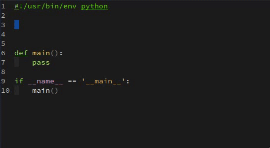
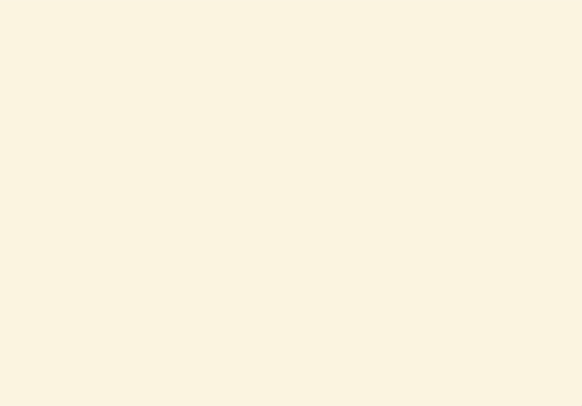
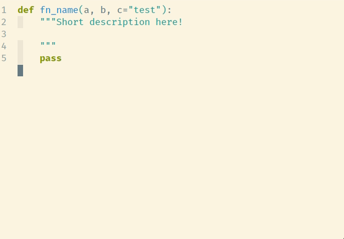
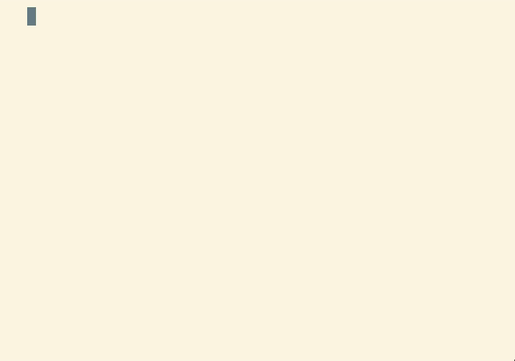

# The Radical Yasnippet Collection

This repository contains a small collection of *radical* snippets for
[yasnippet](https://github.com/joaotavora/yasnippet).


# Installation

As this collection has only just been created, for the time being this
collection is not available on [MELPA](https://melpa.org/). In the meantime, you
may install it directly from my [personal
archive](https://gustafwaldemarson.com/elpa/). This can be done by adding the
following snippet to your `emacs`.


```emacs-lisp
(require 'package)
(add-to-list 'package-archives
             '("xaldew" . "https://gustafwaldemarson.com/elpa/"))
(add-to-list 'package-unsigned-archives "xaldew")
(package-initialize)
```

Once that is done, then just refresh the packages and install it with:

* <kbd>M-x package-refresh-contents</kbd>
* <kbd>M-x package-install yasnippet-snippets</kbd>


Alternatively, you can also install the package using e.g.
[use-package](https://github.com/jwiegley/use-package) with the following
snippet in your `.emacs`:

```
  (use-package yasnippet-radical-snippets
    :ensure t
    :defer t)
```

# Examples

Below are some examples of the snippets available in this repository, with some
caveats listed below.

## Python

### Non-Type Annotated Function - Google Style



### Non-Type Annotated Function - ReST Style



### Type Annotated Function

Requested, but not implemented yet.

### Update Existing Function Arguments



### Python Class Documentation



## C/C++

### Documented Function - Doxygen Style

This snippet attempts to grab type-information using the
[Semantic](https://www.gnu.org/software/emacs/manual/html_node/emacs/Semantic.html)
backend, falling back to regexp based extraction should it fail or not be
available.


# Contributing

If you have a similarly interesting snippet that you think is too complex for a
general collection, feel free to create an issue or pull-request to discuss it.

If you have found a bug in any of the available snippets and want to report it,
please provide a minimal example that can reproduce it; these snippets are often
a bit difficult to debug so please make it as easy as possible for us.
